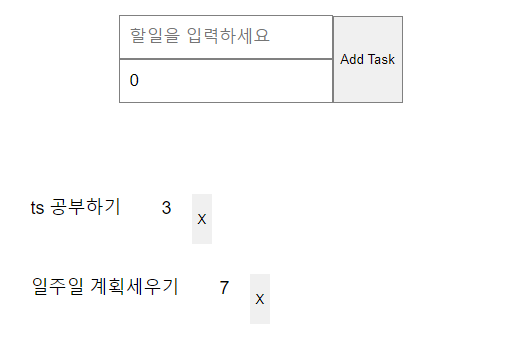

## Make TodoList. `Typescript` with React

타입스크립트로 투두리스트 만들기!!

### 느낀점
`interface`를 생성해서 데이터 타입 정의용을 따로 만들어서 대입하는 형식이 독특하면서 가독성이 좋아보인다.

타입을 지정해주면서 코드를 짜는게 변수 선언시 타입을 미리 정하는 C언어가 많이 생각난다. (`int`, `char`, `string` 등등..)

  

[참고] https://youtu.be/bjnW2NLAofI