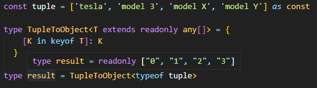
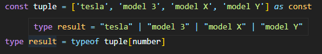

## 문제

배열(튜플)을 받아, 각 원소의 값을 key/value로 갖는 오브젝트 타입을 반환하는 타입 구현하기

<br>

### 예시

```tsx
const tuple = ['tesla', 'model 3', 'model X', 'model Y'] as const

type result = TupleToObject<typeof tuple> 
{ 
	tesla: 'tesla', 
	'model 3': 'model 3', 
	'model X': 'model X', 
	'model Y': 'model Y'
}
```
<br>

## 문제 풀이

T 에 있는 모든 값들을 객체로 만들어야 하기 때문에 T값을 순회하는 `in`을 우선 사용했다.

그 다음에 `keyof`를 사용하여 문제를 풀려고 했지만



`keyof`를 사용하면 객체로 만들어지지 않고 인덱스의 값으로 배열이 만들어지는 모습을 볼 수 있다.

배열값 그대로를 가지고 오는 방법을 찾아보니까



union 타입으로 가져오는 방법이 있다! 그래서 keyof 말고 `T[number]` 로 작성해주었다.

[참고]:[https://code-masterjung.tistory.com/50](https://code-masterjung.tistory.com/50)

<br>

## 해답
```tsx
type TupleToObject<T extends readonly any[]> = {
  [K in T[number]]: K
}
```