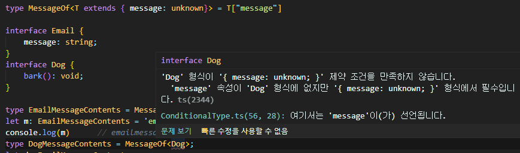

# 조건부 타입 (Conditional Type)

```tsx
T extends U ? L : R
```

T가 U에 할당이 가능하면 L, 아니면 R

<br>

예시

```tsx
interface Animal {
    live(): void
}

interface Dog extends Animal {
    woof(): void
}

interface Cat {
    meow(): void
}

type ex1 = Dog extends Animal ? number : string;
//  ex1 = number
const maru: ex1 = 5;
console.log(maru)       // 5

type ex2 = Cat extends Animal ? number : string;
//  ex2 = string
const junjji: ex2 = 'string';
console.log(junjji)     // string
```

<br>


<br>

## 제네릭

조건부 타입은 제네릭과 사용할때 효율적이다

```tsx
interface IdLabel{
    id: number
}
interface NameLabel{
    name: string
}

// 함수 오버로딩
function createLabel(id: number): IdLabel;
function createLabel(name: string): NameLabel;
function createLabel(nameOrId: string | number): IdLabel | NameLabel;
function createLabel(nameOrId: string | number): IdLabel | NameLabel {
  throw "unimplemented";
}

let a = createLabel("typescript");      // 'unimplemented'
let b = createLabel(2.8)                // 'unimplemented'
let c = createLabel(Math.random() ? "hello" : 42)   // 'unimplemented'
```

이와 같이 오버로딩된 함수를 제네릭으로 작성하면

```tsx
type NameOrId<T extends number | string> = T extends number ? IdLabel : NameLabel;

function createLabel<T extends number | string>(idOrName: T): NameOrId<T> {
    throw "unimplemented";
  }

let a = createLabel("typescript");      // 'unimplemented'
let b = createLabel(2.8)                // 'unimplemented'
let c = createLabel(Math.random() ? "hello" : 42)   // 'unimplemented'
```

코드가 더 간결해진다

<br>


<br>

## 조건부 타입으로 제한하기



여기서 에러가 발생하기 때문에

`MessageOf`가 아무타입이나 받을 수 있고, `message` 프로퍼티가 없으면 `never` 타입으로 결정할 수 있게 코드를 작성하려면

제약 조건을 바깥으로 옮기고 조건부 타입을 적용하면 에러가 발생하지 않는다.

```tsx
type MessageOf<T> = T extends { message: unknown } ? T["message"] : never;
```

```tsx
interface Email {
    message: string;
}
interface Dog {
    bark(): void;
}

type EmailMessageContents = MessageOf<Email>;
let m: EmailMessageContents = 'emailmessage'
console.log(m)      // emailmessage
type DogMessageContents = MessageOf<Dog>;
let d: EmailMessageContents = 'dog';
console.log(d)      // dog
```
