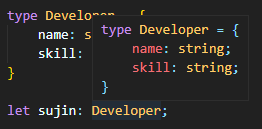
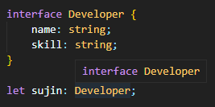

# 타입 별칭 (Type Aliases)
특정 타입이나 인터페이스를 참조할 수 있는 타입 변수

```tsx
// string type
const name2: string = 'sujin';

// 타입 별칭
type Myname = string;
const name3: Myname = 'sujin';
```

`string`과 `number` 뿐만 아니라, `interface`에도 별칭 부여 가능

```tsx
// interface
type Developer = {
    name: string;
    skill: string;
}

// Generic
type User<T> = {
    name: T
}
```

<br>

## 특징

정의한 타입에 대해 나중에 쉽게 참고할 수 있게 이름을 부여하는것과 같다




### `type` vs `interface`

이 둘의 가장 큰 차이는 타입의 확장 가능/불가능 여부

인터페이스는 확장이 가능하지만 타입 별칭은 확장이 불가능하다

`interface`로 선언하여 사용하는 것 추천!!