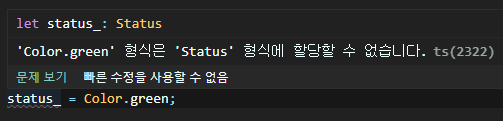

# 타입 호환 (Type Compatibility)
: 타입스크립트 코드에서 특정 타입이 다른 타입에 잘 맞는지를 의미하는 것

```tsx
interface Ironman {
	name: string;
}

class Avengers {
	name: string;
}

let i: Ironman;
i = new Avengers();    // OK, because of structural typing
```

→ error 발생 X

<br>

## 구조적 타이핑

: 코드 구조 관점에서 타입이 서로 호환되는지의 여부를 판단하는 것

```tsx
interface Avengers {
    name: string;
}

let hero: Avengers;
// 타입스크립트가 추론한 y의 타입은 { name: stringl; location: string }
let capt = { name: "Captain", location: "Pangyo" };
hero = capt;
console.log("capt: " + capt)   // capt: [object Object]
console.log("hero: " + hero)   // hero: [object Object]
```

→ `capt`가 `hero` 타입에 호환될 수 있는 이뉴는 `capt` 속성 중에 `name`이 있기 때문이다

→ `Avengers` 인터페이스에서 `name` 속성을 가지고 있기 때문에 `capt`는 `Avengers` 타입에 호환된다

<br>

```tsx
function assemble(a: Avengers) {
    console.log("어벤져스 모여라", a.name);
		// Avengers 인터페이스 안에 location은 없어서 a.location을 입력하면 에러 발생
}
assemble(capt);   // 어벤져스 모여라 Captain
```

→ `capt` 변수에 이미 `name` 속성이 있어서 `assemble` 함수의 호출 인자로 넘길 수 있다.

<br>

## Soundness

타입스크립트는 컴파일 시점에 타입을 추론할 수 없는 특정 타입에 대해서 일단 안전하다고 본다.

→ It is said to not be sound

<br>

## Enum 타입 호환 주의 사항

이넘 타입은 `number` 타입과 호환되지만 이넘 타입끼리는 호환되지 않는다.

```tsx
enum Status { Ready, Waiting };
enum Color { mint, sky, green };

let status_ = Status.Ready;
status_ = Color.green;       // error
```



<br>

## Class 타입 호환 주의사항

클래스 타입은 클래스 타입끼리 비교할 때 스태틱 멤버(`static member`)와 생성자(`constructor`)를 제외하고 속성만 비교한다

```tsx
class Hulk {
    handSize: number;
    constructor(name: string, numHand: number) { }
}

class Captain {
    handSize: number;
    constructor(numHand: number) { }
}

let a: Hulk
let s: Captain = new Captain(10);

a = s;  // ok
s = a;  // ok
```

<br>

## Generics

제네릭은 제네릭 타입 간의 호환 여부를 판단할때, 

타입 인자 `<T>`가 속성에 할당 되었는지를 기준으로 한다.

```tsx
interface Empty<T> {
}
let x: Empty<number>;
let y: Empty<string>;

x = y;     // OK
```

<br>

→ 속성(member 변수)이 없기 때문에 `x = y`

인터페이스에 속성이 있어서 제네릭의 타입 인자가 속성에 할당되면 ⬇️

```tsx
interface NotEmpty<T>{
    data: T;
}
let a: NotEmpty<number>;
let b: NotEmpty<string>;

a = b;
```


인터페이스 `NotEmpty`에 넘긴 제네릭 타입 `<T>`가 `data` 속성에 할당되었으므로 `x` 와 `y`는 서로 다르다